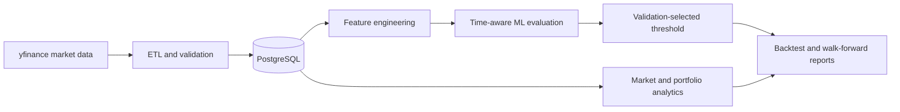

# Quant-AI Research Platform

[](https://github.com/BStofftTX/quant-ai-research-platform/actions/workflows/ci.yml)
[](https://github.com/BStofftTX/quant-ai-research-platform/actions/workflows/codeql.yml)
[](https://www.python.org/)
[](#project-status)

A Python quantitative-engineering and machine-learning research platform for ingesting, storing, analyzing, modeling, and backtesting financial market data.

The project emphasizes modular design, reproducible time-series evaluation, explicit risk measurement, and automated tests. It is designed for research and education—not live trading or investment advice.

## Project status

The repository contains a working analytical library and research workflows. It supports historical market-data ingestion, PostgreSQL persistence, security and portfolio analytics, logistic-regression experiments, validation-based threshold selection, and walk-forward evaluation.

It does **not** place trades, manage brokerage accounts, guarantee predictive performance, or model every cost and market constraint required for production trading.

## Engineering highlights

- Modular ingestion, persistence, analytics, modeling, and backtesting layers
- Time-ordered train/validation/test and walk-forward splits
- Validation-based decision-threshold selection
- Prior-period signal alignment to reduce look-ahead leakage in backtests
- Benchmark, factor-regression, tail-risk, drawdown, and portfolio analytics
- PostgreSQL upserts for reproducible local market-data storage
- Locked Python environment with automated testing, formatting, dependency auditing, and CodeQL

## Architecture



| Module | Responsibility |
| --- | --- |
| `ingest.py` | Coordinate historical data updates |
| `etl.py` | Download and normalize market data |
| `database.py` | Persist and retrieve PostgreSQL records |
| `market_analysis.py` | Security, benchmark, factor, risk, and portfolio analytics |
| `modeling.py` | Features, logistic regression, threshold selection, and walk-forward research |
| `backtest.py` | Strategy returns, equity curves, drawdowns, and benchmark comparisons |

## Capabilities

### Market and performance analytics

- Historical market-data ingestion using `yfinance`
- Total return, CAGR, daily return, and annualized volatility
- Benchmark-relative return, correlation, beta, R-squared, and annualized alpha
- One-factor regression with standard errors, confidence intervals, and significance statistics
- Rolling volatility, correlation, and beta
- Abnormal-return ranking using regression residuals and z-scores

### Risk and portfolio analytics

- Maximum drawdown
- Sharpe, Sortino, and Calmar ratios
- Downside deviation
- Historical Value at Risk and Expected Shortfall at 95% and 99%
- Equal-weight and custom-weight portfolios
- Portfolio return, volatility, risk-adjusted return, and drawdown reporting

### Machine-learning research

- Financial time-series feature engineering
- Forward-return classification targets
- Chronological train/test and train/validation/test partitions
- Logistic-regression classification
- Probability-based trading signals
- Validation-based threshold selection
- Strategy versus buy-and-hold comparison
- Walk-forward model evaluation and stability summaries

## Quick start

### Requirements

- Python 3.12+
- [uv](https://docs.astral.sh/uv/)
- PostgreSQL for ingestion and persisted-data workflows

### Install

```bash
git clone https://github.com/BStofftTX/quant-ai-research-platform.git
cd quant-ai-research-platform
uv sync --locked --dev
```

### Run the automated checks

```bash
uv run pytest -q
uv run ruff check .
uv run ruff format --check .
uv run pip-audit
```

The test suite uses synthetic in-memory data and does not require PostgreSQL or network access.

### Configure the research database

```bash
createdb quant_ai_research
psql quant_ai_research < sql/schema.sql
```

The current local connection uses the PostgreSQL defaults and database name `quant_ai_research`.

### Ingest and analyze data

```bash
uv run python -m quant_ai_research_platform.ingest
uv run python -m quant_ai_research_platform.market_analysis
```

Market-data availability and terms are controlled by the upstream provider. Review provider licensing before redistributing data or derived datasets.

## Research limitations

- Historical results do not predict future performance.
- Backtests do not currently provide a complete production model of fees, spreads, slippage, taxes, liquidity, borrowing, market impact, or execution latency.
- Data quality, symbol history, delistings, corporate actions, and survivorship effects can materially change results.
- Model selection, feature design, and repeated experimentation can create overfitting and data-snooping bias.
- Time-aware splits reduce leakage risk but do not replace independent replication and out-of-sample validation.
- PostgreSQL configuration is currently local and intentionally minimal.

See [ROADMAP.md](docs/ROADMAP.md) for the next research and engineering milestones.

## Repository structure

```text
src/quant_ai_research_platform/   analytical and modeling library
tests/                            synthetic-data regression tests
sql/schema.sql                    PostgreSQL market-data schema
docs/ROADMAP.md                   evidence and engineering milestones
.github/                          CI, CodeQL, and contribution templates
```

## Contributing and security

- Read [CONTRIBUTING.md](CONTRIBUTING.md) before proposing a change.
- Report vulnerabilities privately using [SECURITY.md](SECURITY.md).
- Never commit brokerage credentials, database passwords, proprietary market data, or personal financial information.

## Financial disclaimer

This software is provided for research and educational purposes only. It is not investment, tax, legal, or financial advice; it is not a recommendation to buy or sell any security; and it is not a production trading system. Independently verify all data, calculations, assumptions, and results before making decisions.
